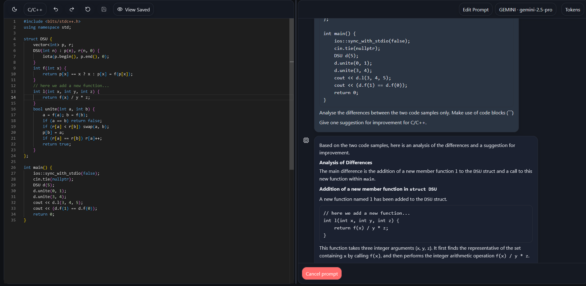

# AI, help me out!

Ever wanted to know what where you went wrong with that last commit to main, but hate pasting all your code in LLM's each time ánd are you allergic to CLI? Well, no more!

Live demo: [https://papzak.loetcodes.nl/AIHelpmeout/](https://papzak.loetcodes.nl/AIHelpmeout/) (keys are stored locally only, but always be cautious with your keys!)

---



---

## What this is

Summary: You get to edit some code and compare it to the last saved code with a LLM, you get to configure the prompts.

More technically phrased it is a client‑only React app, built with Vite and TypeScript. It uses Monaco for the editor, Radix for the dialogs and tooltips, Zustand for state, and a small set of UI utilities. You can point it at OpenAI, Gemini, or Claude with your own API keys. 

## How it works

Change your code in the code editor on the left, and then you can click 'Save & Prompt' on near the bottom middle. This will save your current code and compare it to the **last saved code snippet**. You can view what code that is with the 'View Saved' button. You can change the prompts with the 'Edit Prompt' button on the top right.

**Note**: Only OpenAI and Gemini model API integration have been tested.

### Features/highlights

* VS Code‑style editor with syntax highlighting and per‑language undo or redo
* Language dropdown for Kotlin, Java, C#, C or C++, Python, HTML, CSS, JavaScript [will take suggestions for future languages!]
* Dark or light mode, consistent color palette via CSS variables
* View Saved toggle to overlay the last saved version read‑only
* Revert to default, Save, and Save & Prompt
* Prompt dialog to customize the global and language prompts with character limits
* Chat on the right with Markdown and code blocks, plus gradual text reveal
* Resizable split view with sensible min sizes and persistence
* Tokens dialog that stores your keys locally only

---

## Stack and folders

* **Vite + React + TypeScript** for a fast dev loop.
* **Monaco** editor via `@monaco-editor/react` for VS Code‑like editing.
* **Zustand** for simple app state with localStorage persistence.
* **Radix** Dialog, Tooltip, and Dropdown for accessible UI parts.
* **Tailwind** for light utility styling, plus a small set of custom CSS variables.

```
src/
  components/           UI building blocks
  lib/
    providers/          openai.ts, gemini.ts, anthropic.ts
    config.ts           all tweakable constants
    defaults.ts         default code per language
    languages.ts        language dropdown, labels
    markdown.tsx        react-markdown + rehype highlight wrapper
    state.ts            Zustand store and persistence
    utils.ts            helpers including prompt composition
  App.tsx               layout and routing glue
```

---

## In practice

* Editor on the left uses Monaco and keeps three versions per language: default, last saved, and current. Undo or redo is scoped per language by giving each language its own Monaco `path`.
* Save writes current to saved. View Saved overlays the last saved code as read‑only, so you can compare by eye.
* Save & Prompt first saves, then composes a Markdown prompt with two fenced blocks: last saved and newly saved. Your global prompt and your language prompt are appended after the blocks.
* The right side calls your selected provider directly from the browser and shows a chat bubble with a smooth typing reveal. You can cancel a prompt which aborts the request and stops the reveal.
* All per‑language chats and editor states persist in localStorage. Theme, panel size, and selected language do as well.

### Prompt configuration

Open the Prompt dialog in the top right. Edit:

* **Global prompt**. Default: "Analyse the differences between the two code samples only. Make use of code blocks (```)"
* **Language prompt**. Default: "Give one suggestion for improvement for <language>."

Each field has a character limit. Over the limit the Save button is disabled and animates to show why. Limits are defined in `src/lib/config.ts`.

### Supported models

* **OpenAI**: `gpt-4o`, `gpt-4o-mini`
* **Gemini**: `gemini-2.5-pro`, `gemini-2.5-flash`
* **Claude**: `claude-3.5-sonnet`, `claude-3.5-haiku`

You can pick a model from the menu. If there is no key for the selected provider the chat shows a friendly error bubble and scrolls to it.

### Keys and privacy

Keys are kept in localStorage only and sent directly from your browser to the provider. This is convenient for local testing and internal tools. It also means anyone with access to your machine or browser profile can read those keys. Clear the tokens from the Tokens dialog or clear site data if needed.

---

## Quick start

Requirements: Node 18 or newer.

```bash
# clone
git clone https://github.com/Increedible/AIHelpmeout.git
cd AIHelpmeout

# install and run
npm i
npm run dev
# open http://localhost:5173/AIHelpmeout

# build static files
npm run build
npm run preview
```

The app is configured with `base: '/AIHelpmeout/'` so the build works under that sub‑path by default. Change the `base` in `vite.config.ts` if you host elsewhere.

---

## Deployment

You get a static site in `dist/`. Any static server works. Below is a simple Nginx snippet for a site already serving something at the root.

```
# /etc/nginx/sites-available/default
location ^~ /AIHelpmeout/ {
    alias /var/www/AIHelpmeout/dist/;
    try_files $uri $uri/ /AIHelpmeout/index.html;
}
```

* Copy `dist/` to `/var/www/AIHelpmeout` or your preferred path.
* `nginx -t` then reload. If you change the mount path update `vite.config.ts` `base` and rebuild.

**Note on provider calls**. Requests go straight from the browser to provider APIs. OpenAI and Gemini accept browser requests with normal `Authorization` or query key patterns. Claude requires an extra header to allow browser requests. That header is set in the app. If you see CORS or mixed content errors check your browser console and your network tab please!

---

## Configuration you will likely touch

Open `src/lib/config.ts`:

* `DEFAULT_THEME`, `DEFAULT_LANGUAGE`, `PROVIDER_PREFERENCE`.
* Editor limits: `UNDO_MAX_HISTORY`, `MAX_CODE_SIZE`.
* Panel behavior: `MIN_PANEL_PERCENT` for the split.
* Typing reveal: `STREAM_CHAR_RATE`, `MAX_STREAM_MS`.
* Prompt text and limits: `GLOBAL_PROMPT_DEFAULT`, `LANG_PROMPT_DEFAULT_PREFIX`, `GLOBAL_PROMPT_MAX`, `LANG_PROMPT_MAX`.
* UI copy under `STRINGS`.

Open `src/index.css` for the color palette. The app reads from CSS variables, so you can tune light or dark once and it flows through buttons, dialogs, panels, and chat.

---

## Default snippets and languages

* Default snippets live in `src/lib/defaults.ts`. Everything uses four‑space indent
